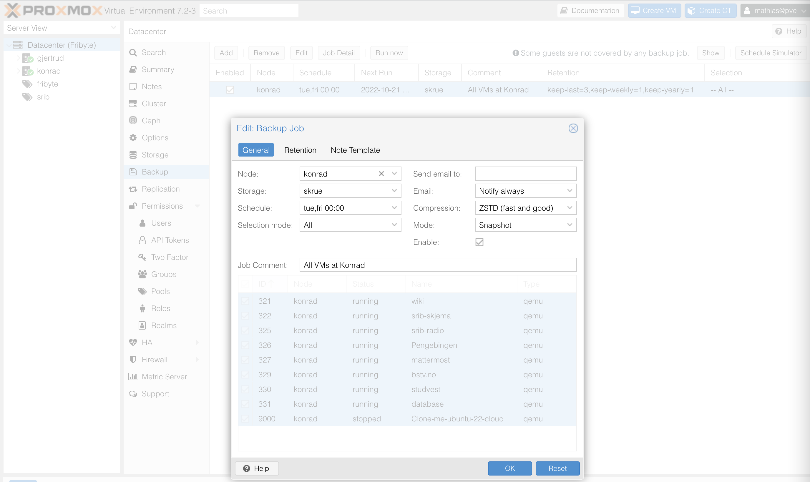

+++
title = "Proxmox VM Backup"
description = "Setting up backup of VMs in Proxmox"
template = "docs/page.html"
sort_by = "weight"
weight = 10005
draft = false

[extra]
lang = "en"
translation = "docs/instrukser/proxmox-backup.md"
+++

## Backup of VMs in Proxmox

As of 2022-10-18, we have automatic backups of all VMs running on Konrad to
Skrue every Tuesday and Friday at 00:00

This is configurable under:

- Datacenter -> Backup

### Risks:

- If the SSH mount of Skrue fails on Konrad, Proxmox will still try to back up
  the VMs to the specified folder, but that folder will then be on local disk
  instead of the actual machine Skrue, and the backup may fail due to
  insufficient space.
  - This is temporarily solved by running `mount -a` on Konrad and Gjertrud,
    both of which mount Skrue.
    - `mount -a` runs all mount commands defined in `/etc/fstab`
