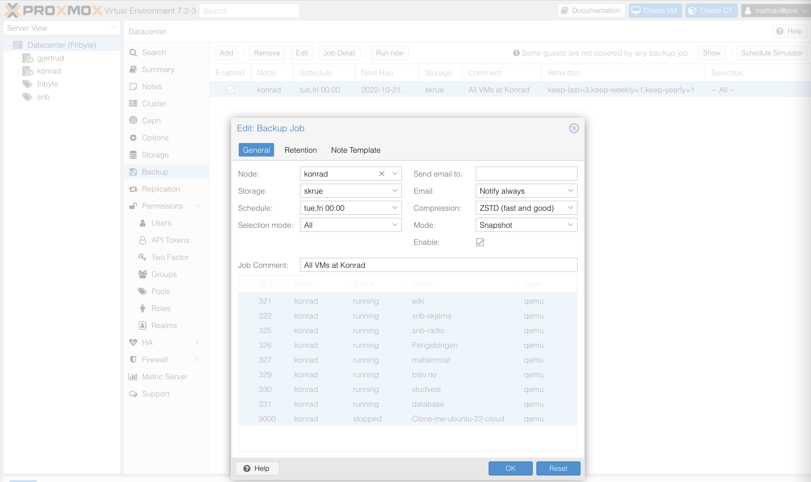

+++
title = "Proxmox VM backup"
description = "Sette opp backup av VM'er i Proxmox"
template = "docs/page.html"
sort_by = "weight"
weight = 5
draft = false
+++

## Backup av VM i proxmox

Per 2022-10-18 har vi automatisk backup av alle VM'er som kjører på Konrad til
Skrue hver tirsdag og fredag klokken 00:00

This is configurable under:

- Datacenter -> Backup

### Faremomenter:

- Om SSH mount av skrue feiler på Konrad vil Proxmox fortsatt prøve å ta backup
  av VM'ene til den spesifiserte mappen, men da vil den spesifiserte mappen være
  på lokal disk istedenfor på faktisk maskinen Skrue og backup kan feile pga for
  liten plass.
  - Dette løses midlertidig med å kjøre `mount -a` på konrad og Gjertrud som
    begge mounter Skrue.
    - `mount -a` kjører alle mount kommandoer som er definert i `/etc/fstab`
